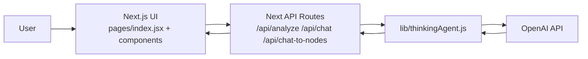

# 03. Architecture

## Follow-up To-do
- [ ] [added: 2026-02-28] [P0] [status: execution-needed] 사용자 노출 문자열을 중앙 관리하는 단일 텍스트 레이어를 도입한다 (UI literal 분산 제거).
- [x] [added: 2026-02-28] [P1] [status: completed 2026-02-28] [Phase 2] `ChatDialog` 비즈니스 로직을 Drawer Chat body로 이관하고 legacy fallback을 병행 운영한다.
- [ ] [added: 2026-02-28] [P1] [status: execution-needed] [Phase 3] `attachedContextNodes` optional contract를 `/api/chat` 경로에 확장한다.
- [x] [added: 2026-02-28] [P0] [status: completed 2026-02-28] `lib/thinkingAgent.js`의 한국어 기본 라벨/fallback 문구를 영어 기본값으로 교체한다.
- [ ] [added: 2026-02-28] [P1] [status: execution-needed] Python backend 유지 시 `backend/logic.py` 프롬프트/출력 언어를 영어 정책과 동기화한다.
- [ ] [added: 2026-02-28] [P1] [status: decision-needed] 중복 구현(JS/Python) 정리 전략을 문서화한다 (단일 소스 또는 생성 파이프라인).
- [x] [added: 2026-02-28] [P2] [status: completed 2026-02-28] 미사용 `onConnect` 핸들러를 제거하거나 실제 연결 기능에 통합한다.

## 1. Document Meta
- Version: `v1.0-draft`
- Status: `Draft`
- Owner: TBD
- Reviewers: TBD
- Last Updated: `2026-02-28`

## 2. High-Level Architecture

## 3. Runtime Boundary
- Primary runtime path(현재 사용자 경로): Next.js + `pages/api/*` + `lib/thinkingAgent.js`
- Secondary/optional path: FastAPI `backend/*` (동일 도메인 로직을 Python으로 별도 보유)

## 4. Frontend Component Architecture

| Component | Role | Key State/Action |
|---|---|---|
| `pages/index.jsx` | 앱 엔트리 | `ThinkingMachine` 렌더링 |
| `components/ThinkingMachine.jsx` | 오케스트레이션 | nodes, edges, suggestions, activeSuggestion, highlightedNodeIds |
| `components/TopBar.jsx` | 상단 네비게이션 바 | Home 액션 + 중앙 타이틀 렌더링 |
| `components/NodeMap.jsx` | 그래프 렌더링 | ReactFlow 노드/엣지 표시, 강조 class 반영 |
| `components/SuggestionPanel.jsx` | 제안 카드 목록 UI (legacy fallback) | `?legacyChat=1` 경로에서 카드 선택/닫기 |
| `components/ChatDialog.jsx` | 제안별 대화/변환 | `/api/chat`, `/api/chat-to-nodes` 호출 |
| `components/RightAgentDrawer.jsx` | Tip/Chat 통합 서랍 + 채팅 본문 | drawer open state, mode(`tip/chat`), context shelf, `/api/chat`, `/api/chat-to-nodes` |
| `components/InputPanel.jsx` | 입력 폼 | Enter 제출, 로딩 상태 반영 |

Frontend visual/style details are managed in `./06-frontend-style.md`.

## 5. API Layer Architecture

| Endpoint | Method | Handler Responsibility |
|---|---|---|
| `/api/analyze` | POST | 입력 검증, `agent.processIdea` 호출, 스키마 에러 가공 |
| `/api/chat` | POST | `agent.chatWithSuggestion` 호출 |
| `/api/chat-to-nodes` | POST | `agent.chatToNodes` 호출, 스키마 에러 가공 |

공통 동작:
1. API 키 확인 (`OPENAI_API_KEY`)
2. singleton agent 캐시 사용 (`cachedAgent`)
3. 비-POST 요청 `405` 반환

## 6. AI Agent Internal Design (`lib/thinkingAgent.js`)

### 6.1 Core Responsibilities
- 모델 입력 프롬프트 조합
- JSON 강제 출력 (`response_format: json_object`)
- 응답 정규화 (`normalize*`) 및 Zod 검증
- 스키마 불일치 시 보정 호출(`repairToSchema`) 수행
- UI가 바로 사용 가능한 노드/엣지 구조 생성

### 6.2 Data Construction Rules
- 노드 위치 계산: phase와 category 기반 기본 좌표 + 슬롯 오프셋
- 생성 노드 수: 1~4
- 제안 노드: 별도 1개 생성(`is_ai_generated=true`)
- 엣지 생성:
  - input 노드 연속 연결
  - main 노드 -> suggestion 연결
  - 기존 노드 cross-connection
  - cross-connection 미생성 시 fallback 연결

### 6.3 Chat-to-Nodes Rules
- 채팅 메시지 정규화 후 요약 노드 생성
- 생성 노드 간 `e-chat-*` 엣지 연결
- 기존 노드와 cross 연결, 없으면 마지막 기존 노드 fallback 연결

## 7. Error Handling Architecture
- API layer:
  - 입력 오류: `400`
  - 메서드 오류: `405`
  - 내부/외부 오류: `500`
- Agent layer:
  - JSON 파싱 실패 예외 처리
  - Zod 검증 실패 시 재보정 시도
- UI layer:
  - analyze/chat-to-nodes 실패: alert
  - chat 실패: 대화창 내 assistant 오류 메시지 삽입

## 8. Technical Debt and Architecture Decisions Pending
1. (Resolved, 2026-02-28) 미사용 `onConnect` 콜백은 제거되어 현재 NodeMap 경로와 불일치가 없다.
2. FastAPI 구현과 JS 구현이 기능적으로 중복되어 동기화 비용이 크다.
3. README가 현재 `pages` 기반 구조를 반영하지 못한다.
4. UI 문구와 프롬프트/오류 문구가 한영 혼합 상태여서 영어 전용 목표와 불일치한다.

## 9. Future Architecture Direction (Recommended)
1. 운영 경로를 Next API로 단일화하거나, 반대로 Python을 표준으로 정하고 프런트 경로를 분리해 중복 제거.
2. API contract를 OpenAPI/JSON Schema로 추출해 프론트/백엔드 동기화 자동화.
3. 관측성(요청 ID, 실패 원인 코드)을 명시적으로 추가해 장애 분석 속도 개선.

## 10. Right Agent Drawer Migration Plan (3 Phases)

### 10.1 Objectives
1. 기존 `SuggestionPanel + ChatDialog` 기능을 유지하면서 UI를 Drawer 기반으로 전환한다.
2. 백엔드 API 계약(`/api/chat`, `/api/chat-to-nodes`)은 단계 2까지 변경하지 않는다.
3. 단계 3에서 context shelf 첨부 정보를 프롬프트 컨텍스트에 결합한다.

### 10.2 State Model (Target)
- `isDrawerOpen: boolean`
- `drawerMode: "tip" | "chat"`
- `drawerAnchorNodeId: string | null`
- `attachedContextNodeIds: string[]`
- `chatMessagesByAnchor: Record<string, Message[]>`

### 10.3 Phase Breakdown
1. Phase 1 (UI shell):
   - Drawer 경계(`rail + right field + content`) 구현
   - mode toggle/close 행동 구현
   - 기존 채팅 로직은 `ChatDialog`에 유지
2. Phase 2 (chat migration, completed 2026-02-28):
   - `ChatDialog`의 비즈니스 로직을 Drawer Chat body로 이관/재사용 완료
   - API payload/response 계약(`/api/chat`, `/api/chat-to-nodes`) 동일하게 유지
   - legacy fallback은 `?legacyChat=1` 경로로 병행 유지
3. Phase 3 (context attachment):
   - context shelf drag attach state 연결
   - API 호출 시 context block을 프롬프트에 병합

### 10.4 Compatibility and Rollback Rules
1. Compatibility:
   - Phase 2 완료 전에는 `ChatDialog` fallback 경로를 제거하지 않는다.
   - context shelf 오류는 채팅 장애로 전파하지 않고 무시 가능한 부가 컨텍스트로 처리한다.
2. Rollback:
   - Drawer 관련 결함 발생 시 `isDrawerOpen=false` 기본 정책 + legacy chat fallback으로 즉시 복구 가능해야 한다.
